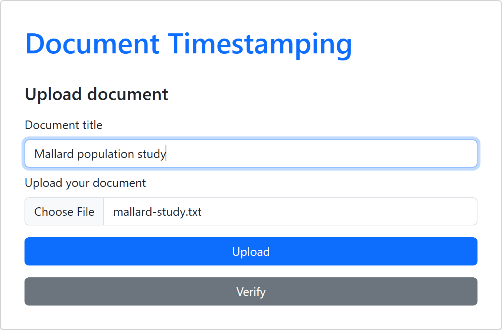
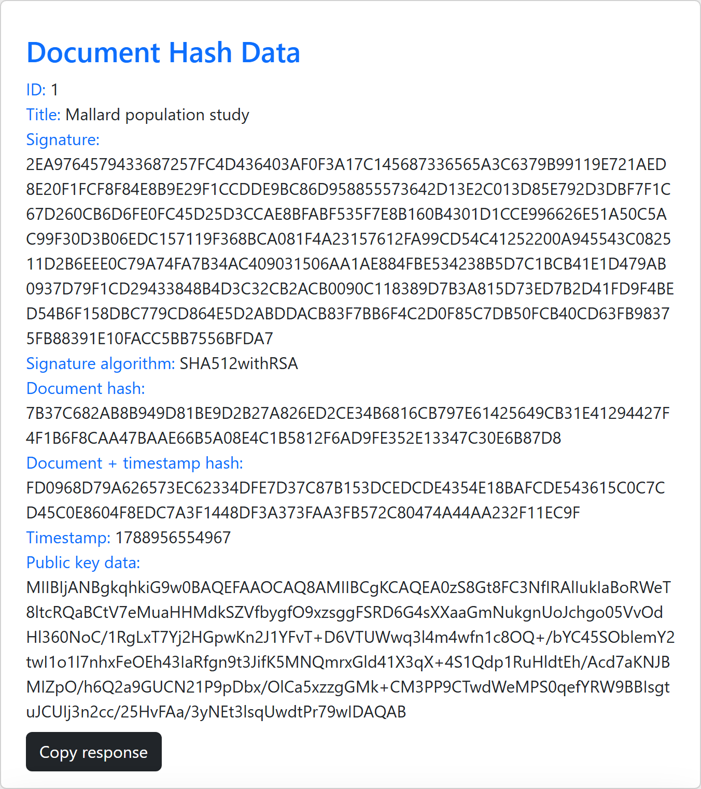

# Document Timestamping

A trusted timestamping service. Upload a document and get back a cryptographic proof that
the file existed in exactly that form at a particular moment. The proof is a signed hash,
and checking it requires no contact with the server. The document, a public key and a short
Java program are enough.

Built by Filip Vojnovski (171214) and Jovan Canevski (185058) as coursework for
Information Security. The original Macedonian write-up is preserved at
[README.mk.md](README.mk.md).

## The idea

A hash proves a document has not changed, but says nothing about when it existed. Adding a
timestamp from someone willing to sign for it turns the hash into evidence of both.

That evidence is only as good as the signature behind it. Anyone can claim a document is
from last March; only the holder of the private key can produce a signature that the
matching public key will open. The server signs, the client keeps the signature, and the
proof survives the server going offline for good, provided the private key was never
compromised.

## Modules

| Module | Stack | Role |
| --- | --- | --- |
| [document-timestamping-api](document-timestamping-api/) | Spring Boot 3.5.3, Java 21, JPA/Hibernate, PostgreSQL | Hashes, timestamps and signs documents |
| [document-timestamping-client-app](document-timestamping-client-app/) | React 19, Vite, Bootstrap 5, axios | Upload and verification UI, generates the verifier source |
| [document-timestamping-client-verification](document-timestamping-client-verification/) | Plain Java, JDK only | Standalone offline verifier |

## How the server timestamps a document

The API exposes one main endpoint, `POST /api/v1/documents/`, taking a title and a file. A
valid request goes to the document service, which runs the hashing and signing pipeline.

### 1. Hash the document

`FileChecksumCalculator.getFileChecksum(MessageDigest, MultipartFile)` streams the upload
through the digest in 1024-byte chunks and returns the checksum. SHA-512 is used for its
collision resistance: producing two documents with the same hash is not practically
achievable, so the checksum can stand in for the document itself.

### 2. Read the server clock

`TimestampingUtility.getCurrentTime()` returns a `java.sql.Timestamp` built from
`System.currentTimeMillis()`. The reading comes from the server rather than the client,
since the client is the one with a reason to misreport it.

### 3. Bind the document to the time

`FileTimestamp.hashFileWithTimestamp` writes the 64-byte checksum into a byte stream, appends
all eight bytes of the epoch millisecond value in big-endian order, and runs SHA-512 over the
combined buffer. The result is a single hash covering both the document and the moment it
arrived, to the millisecond. Any client recomputing this has to lay the bytes out the same
way, so the encoding is fixed in that method and mirrored in the verifier the web client
generates.

### 4. Sign the combined hash

`CipherUtility.signDocumentHash` signs the combined hash with `java.security.Signature` using
`SHA512withRSA` and the private key from the keystore. A 2048-bit key produces a 256-byte
signature, in the standard PKCS#1 form other libraries expect. Knowing the algorithm and
holding the public key is not enough to repeat this step; that requires the private key.

### 5. Persist and respond

The `Document` entity records the title, the signature, the document checksum, the combined
hash and the timestamp. The public key is marked `@Transient`: it travels to the client in the
response but is not a database column, because it is derived from the certificate rather than
owned by the row.

### Response

The client gets back the signature, the timestamp, the public key from the certificate and
the names of both algorithms, which is the full set needed to check the proof later.

```json
{
  "id": 1,
  "title": "Ducks research paper",
  "encryptedHash": "39DB5F85DF6EBF3E18818B18FD232FFA...",
  "documentChecksum": "EAF7542ADE2C338D8D2CC76FCBF883E6...",
  "targetHash": "E201DF538216462F33720C9E4B56AB24...",
  "timestamp": 1788825888422,
  "publicKey": "MIIBIjANBgkqhkiG9w0BAQEFAAOCAQ8AMIIBCgKCAQEAmjqVu6L3...",
  "signatureAlgorithm": "SHA512withRSA",
  "hashingAlgorithm": "SHA-512"
}
```

| Field | Meaning |
| --- | --- |
| `documentChecksum` | SHA-512 of the file on its own |
| `timestamp` | Epoch milliseconds read from the server clock |
| `targetHash` | SHA-512 of the checksum combined with the timestamp |
| `encryptedHash` | The signature over `targetHash` |
| `publicKey` | Base64 X.509 public key, read from the certificate |
| `signatureAlgorithm` | Algorithm to verify the signature with |
| `hashingAlgorithm` | Digest used for both hashing steps |

This response is the proof, so save it somewhere safe.

## Verifying without the server

[document-timestamping-client-verification](document-timestamping-client-verification/) is a
plain Java project with no build file, no dependencies and no network code. It holds two
classes that run on the user's own machine and let a proof be checked when the server is
unavailable.

`ChecksumGenerator` rebuilds `targetHash` from scratch: it reads the document off disk, hashes
it with SHA-512, applies the timestamp the same way the server did, and prints both the plain
checksum and the combined hash. It takes an optional file path and timestamp as arguments, so
one copy can check any document.

`Main` checks the signature. It decodes the Base64 public key through `X509EncodedKeySpec` and
`KeyFactory`, then verifies `encryptedHash` against `targetHash` with `SHA512withRSA`. It
prints `SIGNATURE VALID - OK!` or `DOCUMENT NOT VALID!`.

Run both and compare against the response. A matching `targetHash` from `ChecksumGenerator`
means the document on disk is the one that was uploaded. A valid signature from `Main` means
that hash was signed by the private key behind the certificate. Neither check contacts the
server.

The web client writes both files with the correct values already filled in, so verification
comes down to compiling and running them. `sample.pdf` ships with the module as a document to
try it against.

```
$ javac com/ib/*.java

$ java com.ib.ChecksumGenerator
DOCUMENT CHECKSUM:
EAF7542ADE2C338D8D2CC76FCBF883E62C31336E60CB236F86ED66C8154EA9FB836FD88367880911529BDAFED0E76CD34272123A4D656DB61B120B95EAA3E069
DOCUMENT + TIMESTAMP HASH:
E201DF538216462F33720C9E4B56AB248425B3493D277F1F95FDD1D21DBFFF78046D93EDCD832BC3033179F4C55A4E9721F98ED15B1BF9DB0A9F9E9C604E4CDA

$ java com.ib.Main
ALGORITHM: SHA512withRSA
TARGET HASH: E201DF538216462F33720C9E4B56AB248425B3493D277F1F95FDD1D21DBFFF78046D93EDCD832BC3033179F4C55A4E9721F98ED15B1BF9DB0A9F9E9C604E4CDA
SIGNATURE VALID - OK!
```

Change a single byte of the document, or shift the timestamp by a single millisecond, and
`ChecksumGenerator` prints a completely different hash that the signature will not match.

## Verifying against the API

`POST /api/v1/documents/verify` covers the case where the user still has the document but has
lost the proof. It hashes the uploaded file and looks the checksum up through
`DocumentRepository.findFirstByDocumentChecksumOrderByTimestampAsc`, returning the stored
record with the public key attached. A document submitted more than once has a record for each
submission, and the earliest is returned, since the claim being proved is that the document
existed no later than that moment. This route needs the server, unlike the offline one above.

## Keys and certificates

The server signs with an RSA key pair held in a PKCS#12 keystore and hands out the public half
from an X.509 certificate. Splitting them into two stores keeps the roles clear: the keystore
holds the private key and stays on the server, the truststore holds only the certificate and
is safe to distribute.

The certificate does more than carry a public key. If a signature verifies under a public key
issued by a Certificate Authority, the message is established as signed by the holder of that
certificate, and the CA vouches for who that holder is. The certificate generated below is
self-signed, which is fine for running the project; moving to a CA-issued certificate or a
full chain needs a different keystore, not different code.

`SecureKeysManager` loads both stores. Every location, alias, type and password is read from
configuration, so a deployment points at its own keystore without a rebuild. Locations accept
any Spring resource prefix: `classpath:` while developing, `file:` for a keystore mounted
outside the jar. The public key sent to clients is read from the certificate at request time,
so generating a new keystore is all it takes for the generated verifier code to work against
it.

Certificate expiry is checked before every signature. A timestamp issued under an expired
certificate is not worth holding, so the request fails with a 500 rather than handing back a
proof that will not stand up later.

`BytesHexConverter` handles the hex encoding used for every hash that crosses into the
database or out to the client.

### Generating your own keystore

No key material is committed to this repository. Generate your own with `keytool`, which ships
with the JDK.

Pick a password first, since the commands below use it, and create the directory the server
reads from by default. It is gitignored and so does not exist in a fresh clone:

```bash
export KEYSTORE_PASSWORD="your-keystore-password"
mkdir -p document-timestamping-api/src/main/resources/cipher
cd document-timestamping-api/src/main/resources/cipher
```

Any other location works too, if you point `KEYSTORE_LOCATION` and `TRUSTSTORE_LOCATION` at
it — `file:/path/to/sender_keystore.p12` for a keystore outside the jar.

Create the signing key pair and its self-signed certificate:

```bash
keytool -genkeypair \
  -alias senderKeyPair \
  -keyalg RSA -keysize 2048 \
  -dname "CN=TimestampingSite" \
  -validity 365 \
  -storetype PKCS12 \
  -keystore sender_keystore.p12 \
  -storepass "$KEYSTORE_PASSWORD"
```

Export the certificate:

```bash
keytool -exportcert \
  -alias senderKeyPair \
  -keystore sender_keystore.p12 \
  -storepass "$KEYSTORE_PASSWORD" \
  -file sender_certificate.cer
```

Import it into the store the server reads public keys from:

```bash
keytool -importcert \
  -alias receiverKeyPair \
  -keystore receiver_keystore.p12 \
  -storetype PKCS12 \
  -storepass "$KEYSTORE_PASSWORD" \
  -file sender_certificate.cer \
  -noprompt
```

For PKCS#12 the key password and the store password must match, so leave `-keypass` off and
let it default. Confirm the result with
`keytool -list -keystore sender_keystore.p12 -storepass "$KEYSTORE_PASSWORD"`, which should
show `senderkeypair` as a `PrivateKeyEntry`, and the same command against
`receiver_keystore.p12`, which should show `receiverkeypair` as a `trustedCertEntry`.

Keystores contain private keys and must not be committed. The `cipher/` directory is
gitignored.

## Running it

Requirements: JDK 21, Node 22 or newer. PostgreSQL only if you want persistence — see below.

Generate a keystore first, as described above, then start the API on port 8080:

```bash
cd document-timestamping-api
export KEYSTORE_PASSWORD="your-keystore-password"
./mvnw spring-boot:run -Dspring-boot.run.profiles=dev
```

The `dev` profile keeps documents in an in-memory database, so this needs no PostgreSQL and
no database password. Timestamps do not survive a restart, which is fine for trying the
service out: a proof is verified against the document and the public key, not against the
server. `KEYSTORE_PASSWORD` is still required, because the signing key is the one thing the
service cannot invent for you.

Start the web client on port 3000:

```bash
cd document-timestamping-client-app
npm install
npm run dev
```

### Running against PostgreSQL

Drop the `dev` profile to store timestamps for real. Create the database — `createdb` comes
with PostgreSQL and may not be on your `PATH` on Windows:

```bash
createdb documenttimestamping
```

Then set the environment and start without a profile. Neither password has a default, so the
application will not start without them:

```bash
export DB_URL="jdbc:postgresql://localhost:5432/documenttimestamping"
export DB_USERNAME="postgres"
export DB_PASSWORD="your-database-password"
export KEYSTORE_PASSWORD="your-keystore-password"

cd document-timestamping-api
./mvnw spring-boot:run
```

### Tests

```bash
cd document-timestamping-api
./mvnw test
```

The suite runs against an in-memory H2 database and generates its key pairs at runtime, so it
needs no PostgreSQL instance, no keystore on disk and no environment variables. It covers the
timestamp encoding, the hex conversion, signing and verification, and the full service
pipeline including an offline recomputation of `targetHash` in the same way the client does
it. It also pins the HTTP contract: the documented status codes and error body, the CORS rule,
the endpoint paths, and that an expired certificate stores nothing.

### Configuration

| Variable | Default | Purpose |
| --- | --- | --- |
| `DB_URL` | `jdbc:postgresql://localhost:5432/documenttimestamping` | JDBC connection string |
| `DB_USERNAME` | `postgres` | Database user |
| `DB_PASSWORD` | none, required | Database password |
| `KEYSTORE_LOCATION` | `classpath:cipher/sender_keystore.p12` | Keystore holding the private key |
| `KEYSTORE_PASSWORD` | none, required | Keystore password |
| `KEYSTORE_TYPE` | `PKCS12` | Keystore format |
| `KEYSTORE_KEY_ALIAS` | `senderKeyPair` | Alias of the private key entry |
| `TRUSTSTORE_LOCATION` | `classpath:cipher/receiver_keystore.p12` | Store holding the certificate |
| `TRUSTSTORE_PASSWORD` | falls back to `KEYSTORE_PASSWORD` | Truststore password |
| `TRUSTSTORE_TYPE` | `PKCS12` | Truststore format |
| `TRUSTSTORE_CERTIFICATE_ALIAS` | `receiverKeyPair` | Alias of the certificate entry |
| `APP_CORS_ALLOWED_ORIGINS` | `http://localhost:3000` | Browser origins allowed to call the API, comma-separated |

Uploads are capped at 5 MB per file and 6 MB per request. The API accepts browser requests
only from the origins in `APP_CORS_ALLOWED_ORIGINS`, which defaults to the local React dev
server.

## API

| Method | Path | Body | Success | Failure |
| --- | --- | --- | --- | --- |
| `POST` | `/api/v1/documents/` | `title`, `file` | `201` with the record and its proof | `400` missing title or empty file, `500` signing or keystore failure |
| `POST` | `/api/v1/documents/verify` | `file` | `200` with the stored record | `400` empty file, `404` checksum not on record |

Errors return a JSON body with `status`, `error` and a `message` explaining what went wrong.

This is a demonstrative university project, so the API is intentionally open. Anyone can
submit a document to be timestamped, which is the point of a public timestamping service,
and there is no per-user data to protect. Authentication, rate limiting and storage quotas
are out of scope here and would be added before a real deployment.

## Web client

The React app handles uploading and verifying. Pick a file, give it a title, and press Upload
to send it to the API.



The response is rendered as readable fields with a button to copy the whole payload. Below
that, the app generates the two Java classes described above with the signature, timestamp,
public key, signature algorithm and target hash already filled in, each behind show/hide and
copy controls. Failed requests show the message the API returned rather than leaving the
screen unchanged.



The API base URL defaults to `http://localhost:8080/api/`. Set `VITE_API_URL` to point the
client at another host; `.env.example` shows the format.

## Layout

```
document-timestamping-api/
  src/main/java/com/documenttimestamp/
    api/           DocumentController, ApiExceptionHandler
    service/       DocumentService, DocumentNotFoundException
    repository/    DocumentRepository
    model/         Document
    timestamping/  FileChecksumCalculator, TimestampingUtility, FileTimestamp,
                   CipherUtility, SecureKeysManager, BytesHexConverter
  src/test/java/   FileTimestampTest, CipherUtilityTest, BytesHexConverterTest,
                   DocumentServiceTest
document-timestamping-client-app/
  src/components/  DocumentUpload, DocumentHashData, CodeDisplay
  src/util/        DriverCodeGenerator, ChecksumCodeGenerator, clipboard
document-timestamping-client-verification/
  src/com/ib/      ChecksumGenerator, Main
  sample.pdf
```

## References

- [Trusted timestamping](https://en.wikipedia.org/wiki/Trusted_timestamping)
- [What is a Timestamping Authority](https://blog.ascertia.com/what-is-a-timestamping-authority)
- [Digital signatures](https://www.techtarget.com/searchsecurity/definition/digital-signature)
- [Java digital signatures, Baeldung](https://www.baeldung.com/java-digital-signature)
- [SHA-512 hash in Java](https://www.geeksforgeeks.org/sha-512-hash-in-java/)
- [Connect to PostgreSQL from Spring Boot](https://www.codejava.net/frameworks/spring-boot/connect-to-postgresql-database-examples)
- [Spring Boot file upload](https://mkyong.com/spring-boot/spring-boot-file-upload-example/)
- [File upload in React](https://www.laravelcode.com/post/how-to-upload-files-in-reactjs-with-example)

## License

MIT, see [LICENSE](LICENSE).
